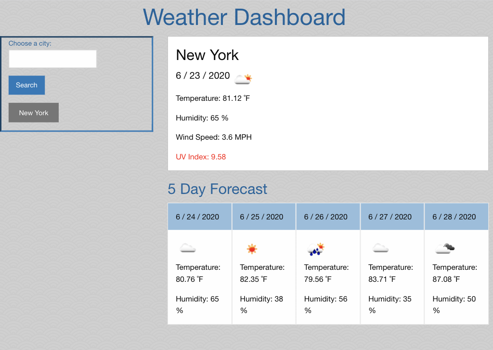

# Weather-Dashboard

This is a Weather Dashboard that presents the current and future 5-Day Weather Forecast for the city entered in. Each entry is saved as a button for future reference and when clicked, the city's information is once again presented. 

The Dashboard uses icons to show the weather conditions and displays the temperature, wind speeds, humidity and UV index which changes colors based on saftey. 

Link: https://vinavarghese.github.io/Weather-Dashboard/

